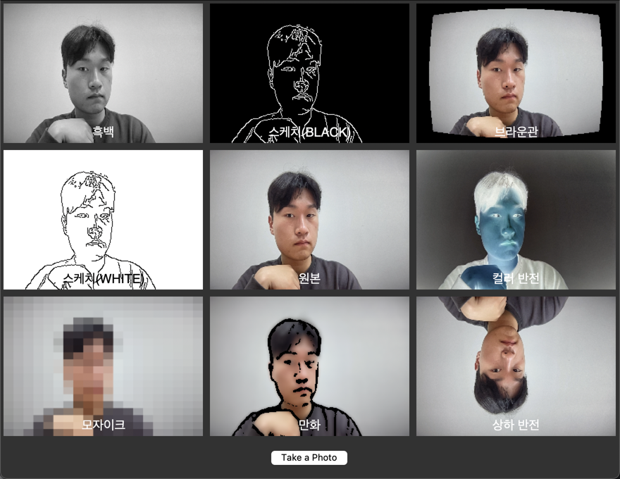

# My_PhotoBooth
# My Photo Booth with openCV

--- 

## Description

This is a simple photo booth application that uses openCV to capture images from a webcam and save them to a folder. It also has a simple GUI that allows the user to select the number of images to capture and the time between each capture.

## Installation

This application requires the following python packages:

* opencv-python
* numpy
* Pillow
* tkinter

```angular2html
pip install opencv-python numpy Pillow tkinter
```

## Usage

1. Run source.py
2. Enjoy your photo booth!
3. Press 'q' to quit the application

## Examples


## References

